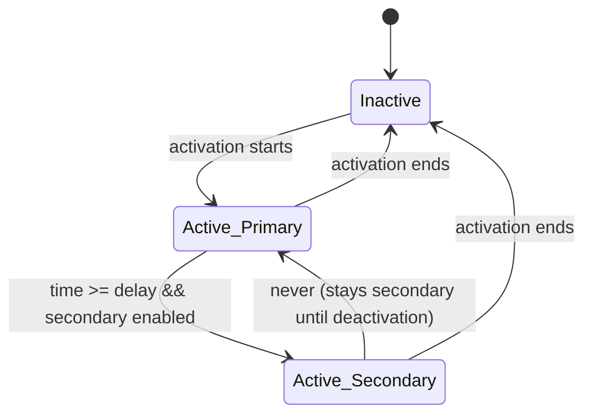

# Universal RCS – Classic Win32 Edition (v2.0)

> **Lightweight, low‑level recoil control with native Windows UI**  
> *Trackbar‑based compensation · Per‑weapon dual‑stage patterns · Global hotkeys · Hold‑to‑activate modes*

   

**Universal RCS (Classic)** is a minimal, dependency‑free recoil compensation tool for PC shooters. It uses the native Windows API and low‑level keyboard/mouse hooks to simulate counter‑recoil movements. The new **dual‑stage** system lets you define a separate set of recoil values that take effect after a configurable delay—perfect for weapons where the recoil pattern changes mid‑burst. All controls update in real time, with live value labels next to every slider.

---

## ✨ Features

| Category | Details |
|----------|---------|
| **Primary recoil pattern** | Four independent sliders for **Left**, **Right**, **Up**, **Down** (0–100). Sensitivity multiplier (0.1–10.0). |
| **Delayed secondary pattern** | Optional second set of sliders that replace the primary values after a user‑defined delay (100–5000 ms). Ideal for weapons that pull harder after a few shots. |
| **Activation modes** | **Toggle key** (customizable), **Hold Mouse 1**, or **Hold Mouse 1+2**. |
| **Global hotkey** | Set any key as the toggle – works while the app is in the background. |
| **Real‑time adjustment** | Move any slider while the game is running – changes apply instantly. |
| **Live value readouts** | Each slider shows its current numeric value in a small bordered box to the right (sensitivity is displayed as a float, delay in milliseconds). |
| **Configuration** | Save/load profiles via standard file dialogs (`.ini` format). “New Config” resets everything to defaults. |
| **Sub‑pixel precision** | Accumulates fractional movements to maintain accuracy over time, with an adjustable step scale for finer control. |
| **Native Win32 UI** | No external runtimes – just a small, fast executable. |

---

## 🖼️ UI Preview

```
┌──────────────────────────────────────────────────────────┐
│ Recoil Control                                     [−][□][×]│
├──────────────────────────────────────────────────────────┤
│ ── Primary Movement ──                                    │
│ Left:      [━━━━━━━━━━━━━━━━━━━━━━]  0  Right:           │
│ (slider)   (value box)                                    │
│ Up:        [━━━━━━━━━━━━━━━━━━━━━━]  0  Down:            │
│ In-game Sens: [━━━━━━━━━━━━━━━━━━━━] 1.00                │
│ Activation: [Toggle Key ▼]                                │
│ [ Set Toggle Key ]   Key: F2                              │
│ Status: Inactive                                          │
│ ─────────────────────────────────────────                 │
│ ☑ Enable Delayed Secondary Settings (optional)           │
│ Delay:  [━━━━━━━━━━━━━━━━━━━━━━]  500  ms                │
│ After the delay elapses, the secondary values below       │
│ replace the primary ones.                                 │
│ ── Secondary Movement (post‑delay) ──                    │
│ Left (2nd): [━━━━━━━━━━━━━━━━━━━━━━]  0                  │
│ Right (2nd):[━━━━━━━━━━━━━━━━━━━━━━]  0                  │
│ Up (2nd):   [━━━━━━━━━━━━━━━━━━━━━━]  0                  │
│ Down (2nd): [━━━━━━━━━━━━━━━━━━━━━━]  0                  │
│                                                           │
│ [ Save Config ]   [ Load Config ]   [ New Config ]        │
└──────────────────────────────────────────────────────────┘
```

> *Actual window size: 540×660 pixels. All controls update live.*

---

## 🔧 How It Works

The application installs two low‑level Windows hooks:
- **`WH_KEYBOARD_LL`** – detects the toggle key (in “Toggle Key” mode) or captures a new key when the user clicks “Set Toggle Key”.
- **`WH_MOUSE_LL`** – monitors left and right button states for the hold modes.

When the activation condition is met:
- A 10 ms timer calculates the required mouse movement.
- By default, values come from the **primary** sliders.
- If **delayed secondary settings** are enabled, the app tracks the time since activation. After the specified delay (`Delay` slider) elapses, it seamlessly switches to the **secondary** slider values.
- The fractional‑pixel algorithm accumulates sub‑pixel corrections, ensuring smooth, precise compensation over long bursts.
- No game memory is read or modified – only synthetic mouse input is generated.

### State machine for dual‑stage patterns



> *Sub‑pixel accumulators are reset at every transition to avoid sudden jumps.*

## 🚀 Getting Started

### Prerequisites

- **Windows 7 / 8 / 10 / 11** (32‑bit or 64‑bit)
- **Visual Studio** (any version with C++ and Windows SDK) or MinGW
- No special libraries – uses only `windows.h`, `commctrl.h`, `commdlg.h`.

### Building

1. Clone or download the source.
2. Open the project in Visual Studio.
3. Create a **Windows Desktop Application** project (or a plain Win32 project).
4. Add the provided `.cpp` file to the project.
5. Set the subsystem to **Windows** (`/SUBSYSTEM:WINDOWS`).
6. Build as **Release** for best performance.
7. Run the executable **as administrator** (required for low‑level hooks).

### First Run

- The default toggle key is **F2**.  
- To change it, click `Set Toggle Key` and press any key.  
- Select the activation mode from the dropdown:  
  *Toggle Key* – press your key to enable/disable.  
  *Mouse 1* – hold left mouse button.  
  *Mouse 1+2* – hold both left and right buttons.  
- Adjust sliders while testing in‑game – the compensation is applied every 10 ms.
- Check **Enable Delayed Secondary Settings** to set a second recoil pattern that kicks in after a delay. Useful for weapons that pull harder after the first few shots.

### Saving & Loading

- Use `Save Config` – choose a location and filename (e.g., `rainbow.ini`).  
- `Load Config` – load a previously saved `.ini` file.  
- `New Config` – resets all values to zero, sensitivity to 1.0, and disables the delay feature.

> ⚠️ **Note**: Low‑level hooks require **administrator privileges**. Right‑click the `.exe` → *Run as administrator*.

---

## ⚖️ Disclaimer

**This software is provided for educational purposes only.**  
Using input‑simulation tools in online multiplayer games may violate the game’s Terms of Service and can result in permanent account bans. The author assumes no liability for any consequences arising from the use of this program. **Do not use it in competitive or anti‑cheat protected environments unless explicitly allowed.**

---

## 🛠️ Technical Details

- **Language**: C++17 (Win32 API)
- **UI**: Native Windows controls (trackbars, buttons, static text, combo boxes)
- **Hooks**: `WH_KEYBOARD_LL`, `WH_MOUSE_LL`
- **Configuration**: Windows INI file API (`WritePrivateProfileStringW`, `GetPrivateProfileIntW`)
- **Timing**: 10 ms timer (`WM_TIMER`) for smooth, low‑latency movement
- **Precision**: Sub‑pixel accumulation (floating‑point accumulators) with a user‑configurable step scale (`STEP_SCALE = 0.5`)
- **Dual‑stage logic**: Tracks activation time and switches to secondary values after the configured delay

### Algorithm Pseudocode

```
on timer (10 ms):
    if active:
        if secondary enabled and (now - activationTime) >= delayMs:
            use secondary sliders
        else:
            use primary sliders

        rawDX = right - left
        rawDY = down - up
        dx = rawDX / (sensitivity / 10) * STEP_SCALE
        dy = rawDY / (sensitivity / 10) * STEP_SCALE

        accumX += dx
        accumY += dy
        moveX = floor(accumX)
        moveY = floor(accumY)
        if moveX != 0 or moveY != 0:
            SendInput(moveX, moveY)
            accumX -= moveX
            accumY -= moveY
```

---

## 📝 License

Distributed under the **MIT License**. See `LICENSE` for more information.

---

## 🙏 Acknowledgements

- Microsoft Windows API documentation
- The low‑level hooking community

---

## 📫 Contributions

Pull requests and suggestions are welcome.  
Please open an issue first for major changes.

---

*Made for users who prefer classic, no‑frills utilities with absolute control, now with per‑weapon timing finesse.*
